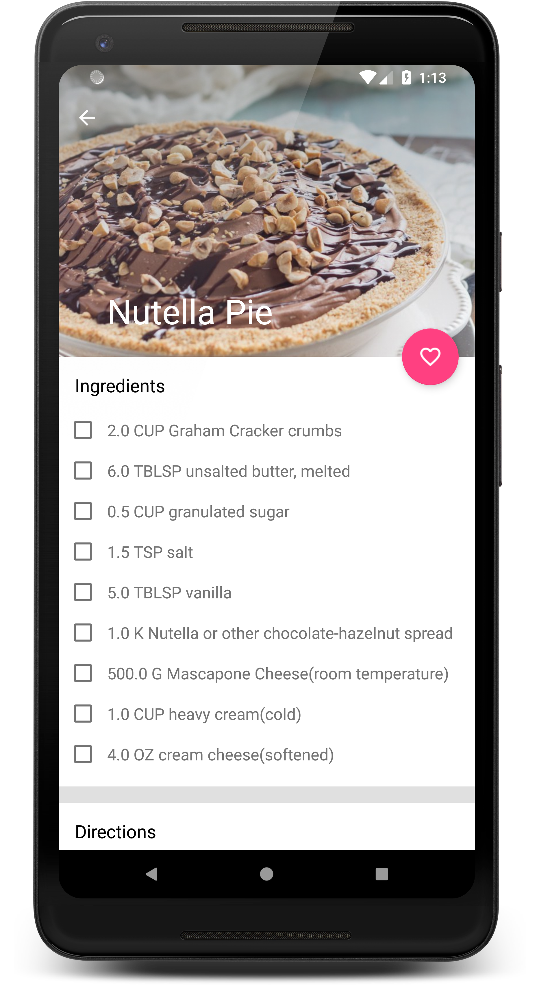

# Baking App

**Platform: Android (Min SDK: 19, Target SDK: 27)**

**Author: [Timotius Oktorio](https://ca.linkedin.com/in/timotiusoktorio "LinkedIn Profile") (toktorio@gmail.com)**

Simple recipes app that can help you discover cake recipes created by Udacity’s resident baker-in-chief, Miriam.

*This app was created as the third project of [Android Developer Nanodegree](https://www.udacity.com/course/android-developer-nanodegree-by-google--nd801) program at Udacity.*

### Features
- Discover cake recipes created by Udacity’s resident baker-in-chief, Miriam.
- View cake recipe details such as ingredients and step-by-step instructions.
- Bake along by watching the instruction videos directly in the app.
- Easily save your favorite cake recipes for offline viewing.
- User interface tailored for both phone and tablet screens.

### What I have learned from this project
- Using [OkHttp](http://square.github.io/okhttp/) library to fetch data remotely from the provided API.
- Using [Room Persistence Library](https://developer.android.com/topic/libraries/architecture/room) to save data persistently in a local database.
- Using [Dagger](https://google.github.io/dagger/) as a dependency injection tool to provide dependencies for classes.
- Using [Android Architecture Components](https://developer.android.com/topic/libraries/architecture/) libraries and [MVVM](https://en.wikipedia.org/wiki/Model%E2%80%93view%E2%80%93viewmodel) software architectural pattern.
- Using [Android Data Binding](https://developer.android.com/topic/libraries/data-binding/) library to bind UI components in layout files to data sources.
- Using [ExoPlayer](http://google.github.io/ExoPlayer/) as an alternative to Android's MediaPlayer API to play videos.
- Transforming provided wireframes into actual user interface for both phone and tablet screen.
- Adding app widget to allow user to quickly use the app from the device home screen.

  

Get the apk file [here](https://github.com/toktorio/Baking-App/blob/master/app/release/baking-app.apk?raw=true) to install the app on your device. Note that depending on your device settings, you might need to allow installation from unknown sources in order to install this app. Visit this [link](https://www.androidcentral.com/unknown-sources) for the detailed instructions.